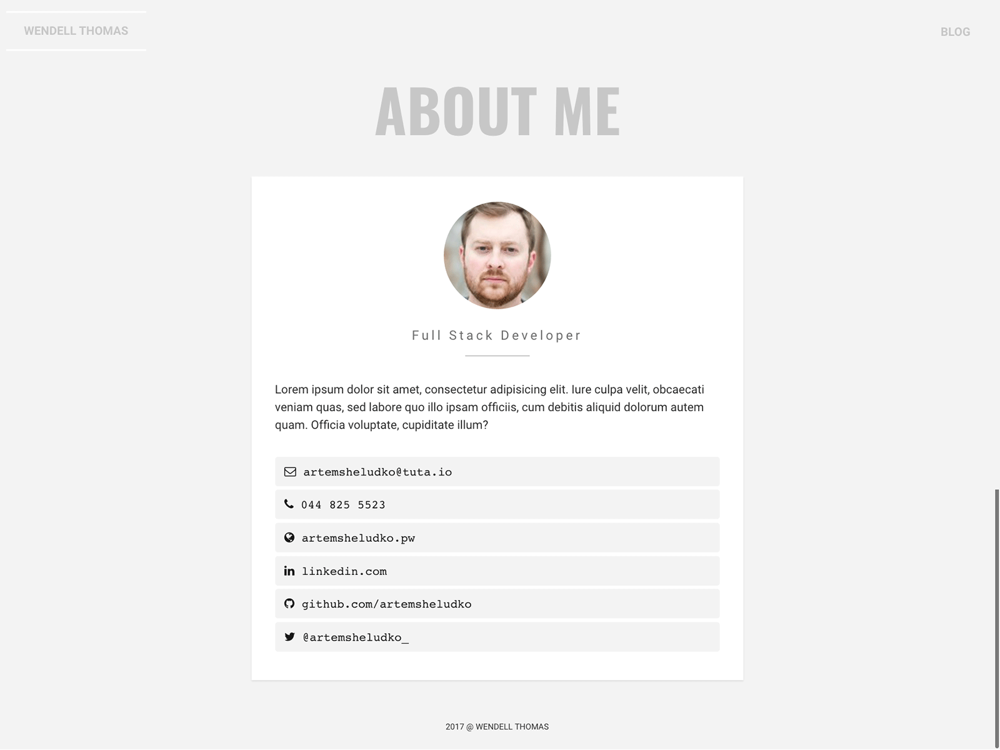

# The Monday Jekyll theme
=========================

Dark Theme:

Light Theme:

# Demo
View this jekyll theme in action [here](http://artemsheludko.pw/monday/)

Integrations
  - [Google Fonts](https://fonts.google.com/)
  - [Google Analytics](https://analytics.google.com/analytics/web/)
  - [Disqus](https://disqus.com/)
  - [Font Awesome](http://fontawesome.io/)
  - Social media links

# How to Use

  For those unfamiliar with how Jekyll works, check out [jekyllrb.com](https://jekyllrb.com/) for all the details,
  or read up on just the basics of [front matter](https://jekyllrb.com/docs/frontmatter/), [writing posts](https://jekyllrb.com/docs/posts/),
  and [creating pages](https://jekyllrb.com/docs/pages/).

## License

GPL-v3.0
